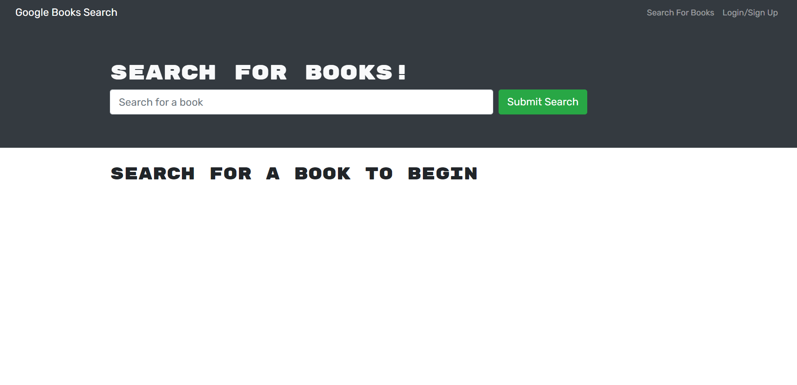
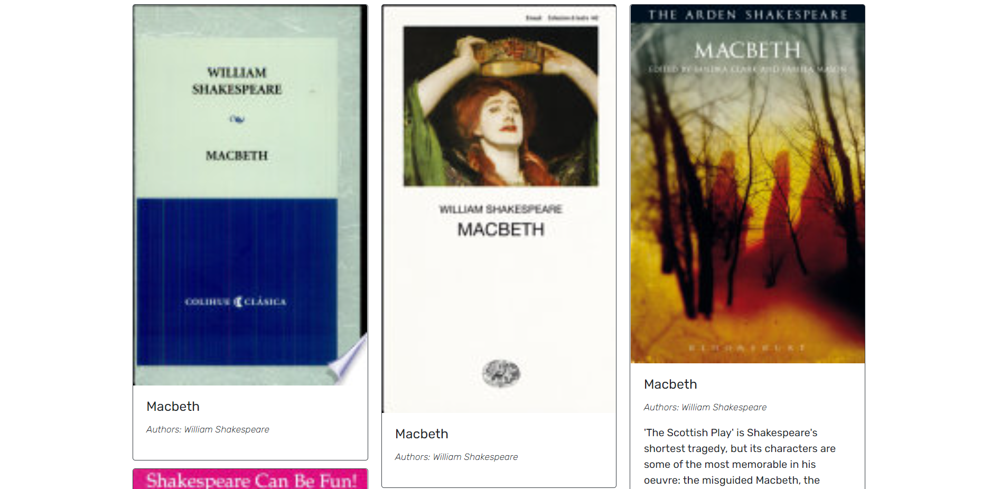
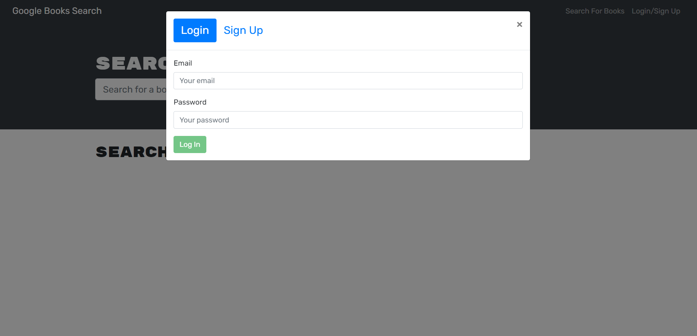
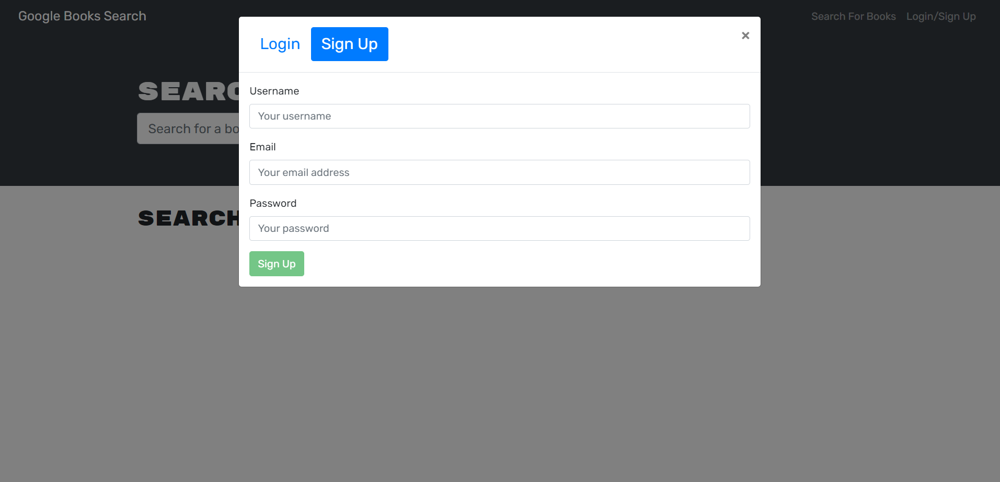
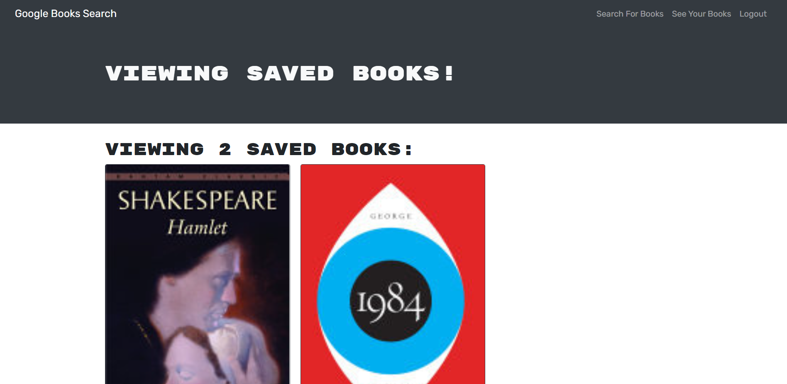
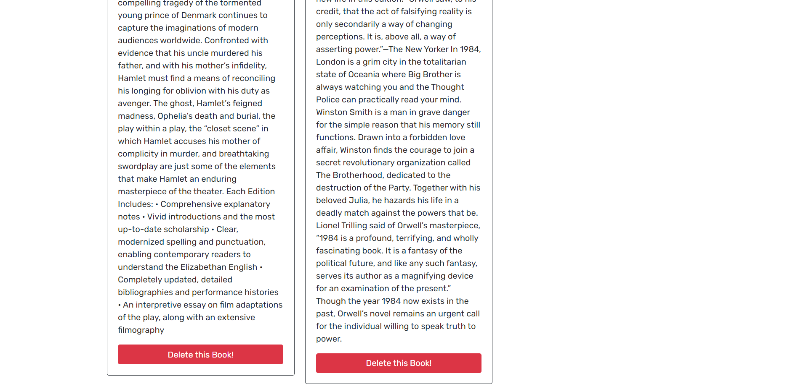
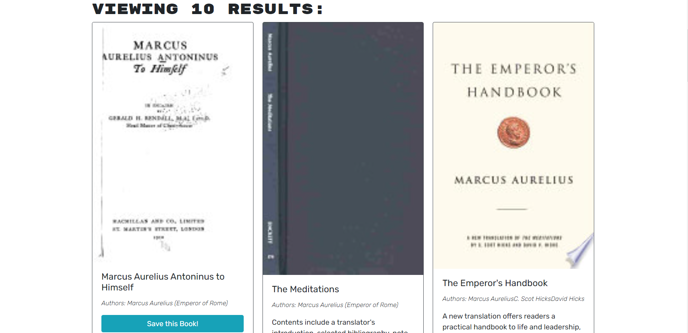

# Book-Search-Website-Ishan-Wijesingha

## Description
This application is used to search for books from the Google Books API. When the application is first loaded, a search bar is shown that can be used to search books by their name. A list of results will appear when a search is made.

There is a menu at the top of the website that allows you to log in to an existing account using an email and password (Login), or create a new account with a username, email and password (Sign Up).

Once you are logged in as a user, you can now save books that appear in the search results of the 'Search For Books' page. You can view these saved books in the 'See Your Books' page of the website. On this page, you can also remove any of the books that you have saved. 

You can also log out once you are logged in.

## Screenshot of Application

## Link to Deployed Application
